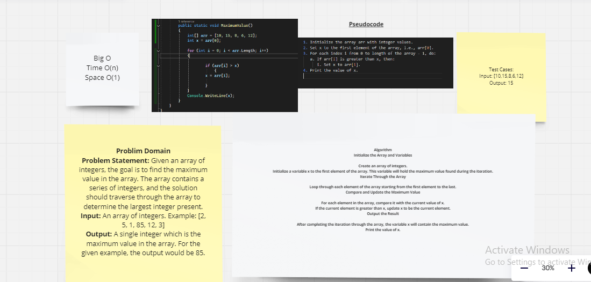

# challenges-and-data-structures

# Table of Contents

## Whiteboard Images

### Challenge A: Array Reversal  [Link](https://github.com/Abed1313/challenges-and-data-structures/blob/main/whiteboard-challenges/assest/S-1.PNG)

<<<<<<< Maximum-Value
### Challenge B: Most Frequent Number
 

### Challenge 3: Maximum Value
 
=======
### Challenge B: Most Frequent Number  [Link](https://github.com/Abed1313/challenges-and-data-structures/blob/main/whiteboard-challenges/assest/S-2.PNG)
>>>>>>> main
